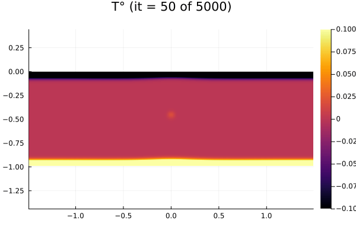

# ThermalConvection3D

[](https://github.com/WhiteFireFox/ThermalConvection3D.jl/actions/workflows/CI.yml?query=branch%3Amain)

Author: Zhihao Cao

Course: [Solving Partial Differential Equations in Parallel on GPUs](https://www.vorlesungen.ethz.ch/Vorlesungsverzeichnis/lerneinheit.view?semkez=2024W&ansicht=KATALOGDATEN&lerneinheitId=182481&lang=en)

## Introduction
Thermo-mechanical convection processes play a fundamental role in geophysical and industrial applications, such as the dynamics of Earth’s mantle and thermal plumes. These phenomena involve complex interactions between viscous flow and heat transfer, governed by the coupled equations of fluid dynamics and heat advection-diffusion. To study such systems, computational models must account for the non-linear behavior of materials, including temperature-dependent viscosity, under varying thermal and mechanical conditions.

This project extends the 2D thermal convection example implemented in ParallelStencil.jl to three dimensions, aiming to develop a high-performance multi-GPU 3D thermo-mechanical convection solver. The solver resolves the intricate behavior of thermal convection cells, capturing both the advection-diffusion of heat and viscous Stokes flow in 3D. By incorporating temperature-dependent shear viscosity, the model achieves a more realistic representation of convection dynamics, providing insights into phenomena such as mantle plumes and convective instabilities.

## File Structure
```plaintext
ThermalConvection3D.jl/
├── README.md
├── Project.toml
├── README.md
├── scripts/
│   ├── ThermalConvection3D.jl              # Temperature Update (Explicit)
│   ├── ThermalConvection3D_Implicit.jl     # Temperature Update (Implicit)
│   ├── sbatch.sh
│   ├── sbatch_implicit.sh
│   ├── Visualise_3D.jl                     # Generating 3D image
│   ├── Visualise_GIF.py                    # Generating GIF
└── docs/
└── src/
└── test/                                   # Unit and Reference Testing
└── bin/
└── .github/workflows/                      # CI
```

## Physical Equations

### 1. Continuity Equation (Mass Conservation)

For incompressible flow, the mass conservation equation is:

$$
\nabla \cdot \mathbf{V} = 0
$$

where $\mathbf{V} = (V_x, V_y, V_z)$ is the velocity field.

### 2. Momentum Equations (Navier-Stokes Equations with Buoyancy)

The momentum equations, incorporating buoyancy via the Boussinesq approximation, are:

$$
\rho \left( \frac{\partial \mathbf{V}}{\partial t} + \mathbf{V} \cdot \nabla \mathbf{V} \right) = -\nabla P + \nabla \cdot \boldsymbol{\tau} + \mathbf{F}_{\text{buoyancy}}
$$

where:
- $\rho$ is the density.
- $P$ is the pressure.
- $\boldsymbol{\tau}$ is the deviatoric stress tensor.
- $\mathbf{F}_{\text{buoyancy}} = \rho_0 g \alpha (T - T_0) \mathbf{e}_z$ is the buoyancy force due to temperature variations ($T$ is temperature, $T_0$ is a reference temperature, $g$ is gravitational acceleration, $\alpha$ is the thermal expansion coefficient, and $\mathbf{e}_z$ is the unit vector in the vertical direction).

The deviatoric stress tensor for a Newtonian fluid is:

$$
\boldsymbol{\tau} = 2 \eta \mathbf{E}
$$

where $\eta$ is the dynamic (potentially temperature-dependent) viscosity, and $\mathbf{E}$ is the strain rate tensor:

$$
\mathbf{E} = \frac{1}{2} \left( \nabla \mathbf{V} + (\nabla \mathbf{V})^\top \right)
$$

### 3. Energy Equation (Heat Equation)

The energy equation accounting for advection and diffusion of heat is:

$$
\frac{\partial T}{\partial t} + \mathbf{V} \cdot \nabla T = \kappa \nabla^2 T
$$

where $\kappa$ is the thermal diffusivity.

## Pseudo-Transient Reformulation (Numerical Method)

To solve the above equations numerically, a pseudo-transient (or artificial compressibility) approach is often used to achieve a stable iterative scheme that can converge to steady-state or handle transient integration. This involves introducing pseudo-time steps for both the momentum and continuity equations, and using iterative solvers for the velocity–pressure coupling.

### 1. Momentum Equation with Pseudo-Time

A pseudo-time $\tau$ is introduced to iteratively solve for velocity fields

$$
\rho_0 \frac{\partial \mathbf{V}}{\partial \tau} + \rho_0 \left( \frac{\partial \mathbf{V}}{\partial t} + \mathbf{V} \cdot \nabla \mathbf{V} \right) = -\nabla P + \nabla \cdot \boldsymbol{\tau} + \mathbf{F}_{\text{buoyancy}}.
$$

By choosing $\frac{\partial \mathbf{V}}{\partial t}$ to represent the physical time derivative and $\frac{\partial \mathbf{V}}{\partial \tau}$ as a pseudo-time derivative, one can iterate in $\tau$ until a quasi-steady state in pseudo-time is reached for each real time step $t$.

### 2. Continuity with Artificial Compressibility

To circumvent solving a Poisson equation directly for pressure, an artificial compressibility $\beta$ can be introduced

$$
\beta \frac{\partial P}{\partial \tau} + \nabla \cdot \mathbf{V} = 0.
$$

As $\tau \to \infty$ (at each physical time step), $\nabla \cdot \mathbf{V} \to 0$, recovering incompressibility. The parameter $\beta$ is chosen to balance stability and convergence rates.

### 3. Temperature Update (Explicit/Implicit Time-Stepping)

Once the velocity field $\mathbf{u}$ is known at time $t$, we update the temperature field using an explicit time-stepping method, as described in the [2D miniapp](https://github.com/omlins/ParallelStencil.jl#thermo-mechanical-convection-2-d-app). The discretized energy equation is

$$
T^{n+1} = T^{n} + \Delta t \left(\frac{dT}{dt}\right),
$$

where $\frac{dT}{dt}$ is computed from the spatial discretization of advection and diffusion terms

$$
\frac{dT}{dt} = -\mathbf{V}\cdot\nabla T + \kappa \nabla^2 T.
$$

However, for the temperature field, we also can use the implicit time-stepping approach with pseudo-transient method to enhance its accuracy and stability. At each physical time step $t$, we can introduce a pseudo-time $\tau$

$$
\frac{\partial T}{\partial \tau} + \frac{T - T_{\text{old}}}{dt} + \mathbf{V} \cdot \nabla T = \kappa \nabla^2 T,
$$

where $T_{\text{old}}$ is the temperature from the previous physical time step and $dt$ is the physical time step size.

## Running

We can get the results by executing this command.
```julia
sbatch ./scripts/sbatch.sh
srun -n8 bash -c "julia --project ./scripts/ThermalConvection3D.jl"
```

Moreover, if we choose to use the implicit temperature update method, the results can be obtained by executing the corresponding command.
```julia
sbatch ./scripts/sbatch_implicit.sh
srun -n8 bash -c "julia --project ./scripts/ThermalConvection3D_Implicit.jl"
```

## Result

We verify our code on a large scale (global grid of `476x156x156`) for 3D thermal porous convection with multi-xPUs (8 GPUs). The results are as follows.

```julia
ar         = 3                               # aspect ratio
nx, ny, nz = 80*ar-1, 80-1, 80-1             # numerical grid resolutions
nt         = 5000                            # total number of timesteps
nout       = 50                              # frequency of plotting
```

### 2D Slice of the 3D Data
We provide a GIF showcasing the 2D slice of the 3D data at $ly/2$.

<div align="center">
    
</div>

### 3D Data Visualization
We provide a file called `Visualise_3D.jl` to generate 3D image from `.bin` file. Then, we use `Visualise_GIF.py` to get a GIF showcasing the 3D data.

<div align="center">
    
</div>

## Test

We run the 3D test for the explicit temperature update method. The test results are as follows.

```julia
julia> include("test/test3D.jl")
Test Summary: | Pass  Total  Time
Unit Test     |    1      1  3.2s
Global grid: 47x15x15 (nprocs: 1, dims: 1x1x1; device support: none)
Animation directory: viz3Dmpi_out/
it = 1 (iter = 470), errV=1.598e-03, errP=1.523e-03
it = 2 (iter = 470), errV=1.636e-03, errP=7.835e-04
it = 3 (iter = 470), errV=1.638e-03, errP=4.986e-04
it = 4 (iter = 470), errV=1.641e-03, errP=3.523e-04
it = 5 (iter = 470), errV=1.661e-03, errP=2.702e-04
Test Summary:  | Pass  Total  Time
Reference Test |    1      1  9.5s
Test.DefaultTestSet("Reference Test", Any[], 1, false, false, true, 1.734327293588e9, 1.734327303125e9, false, "D:\\github\\ThermalConvection3D\\test\\test3D.jl")
```

We run the 3D test for the implicit temperature update method. The test results are as follows.

```julia
julia> include("test/test3D_implicit.jl")
Test Summary: | Pass  Total  Time
Unit Test     |    1      1  3.6s
Global grid: 47x15x15 (nprocs: 1, dims: 1x1x1; device support: none)
Animation directory: viz3Dmpi_out/
it = 1 (iter = 470), errV=1.894e-03, errP=4.188e-03, errT=1.819e-05
it = 2 (iter = 470), errV=5.210e-04, errP=1.888e-03, errT=3.559e-05
it = 3 (iter = 470), errV=5.567e-04, errP=1.035e-03, errT=3.248e-05
it = 4 (iter = 470), errV=9.922e-04, errP=5.453e-04, errT=2.408e-05
it = 5 (iter = 470), errV=1.049e-03, errP=3.399e-04, errT=9.792e-05
Test Summary:  | Pass  Total   Time
Reference Test |    1      1  10.8s
Test.DefaultTestSet("Reference Test", Any[], 1, false, false, true, 1.734328533989e9, 1.734328544813e9, false, "D:\\github\\ThermalConvection3D\\test\\test3D_implicit.jl")
```

Finally, after submitting to Github, CI Test will be started.

## References
[1] https://github.com/omlins/ParallelStencil.jl#thermo-mechanical-convection-2-d-app

[2] http://jupiter.ethz.ch/~pjt/papers/tackley2008pepi_yinyang.pdf

[3] https://se.copernicus.org/articles/13/583/2022/se-13-583-2022.pdf
